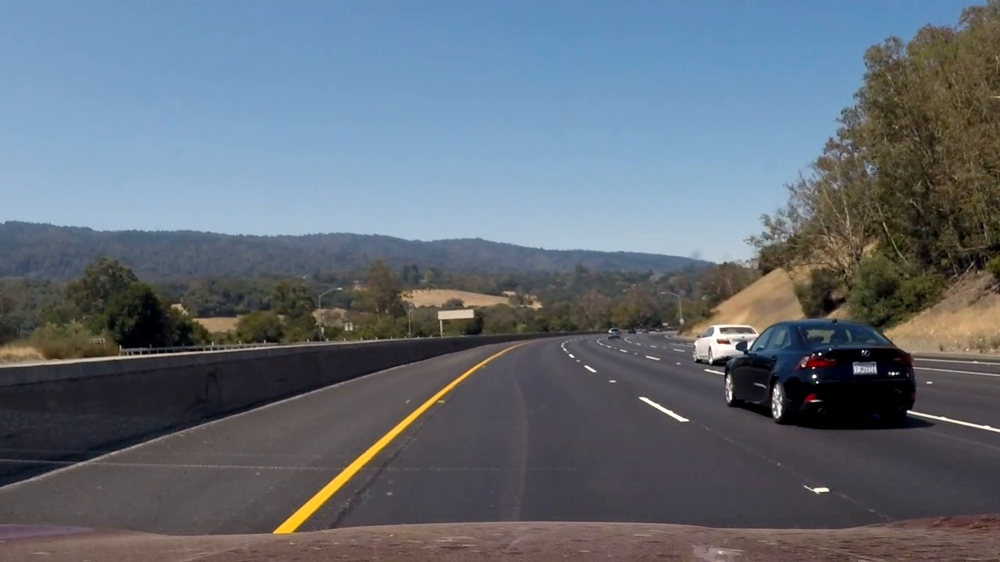
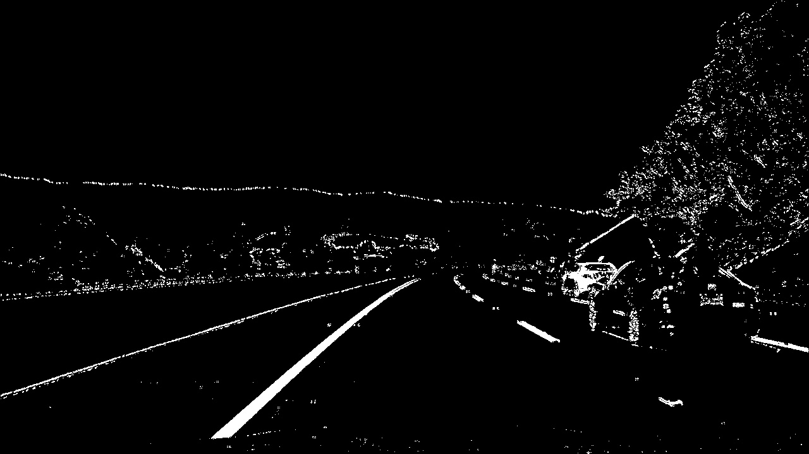
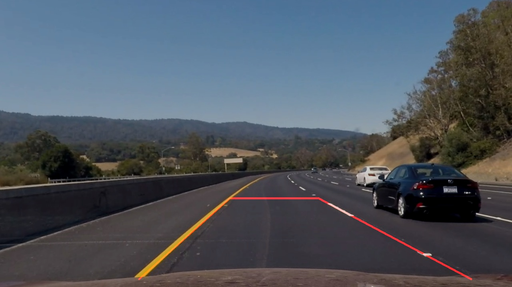
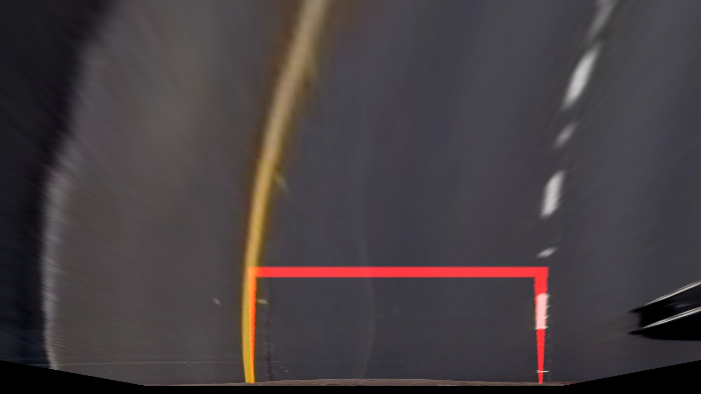
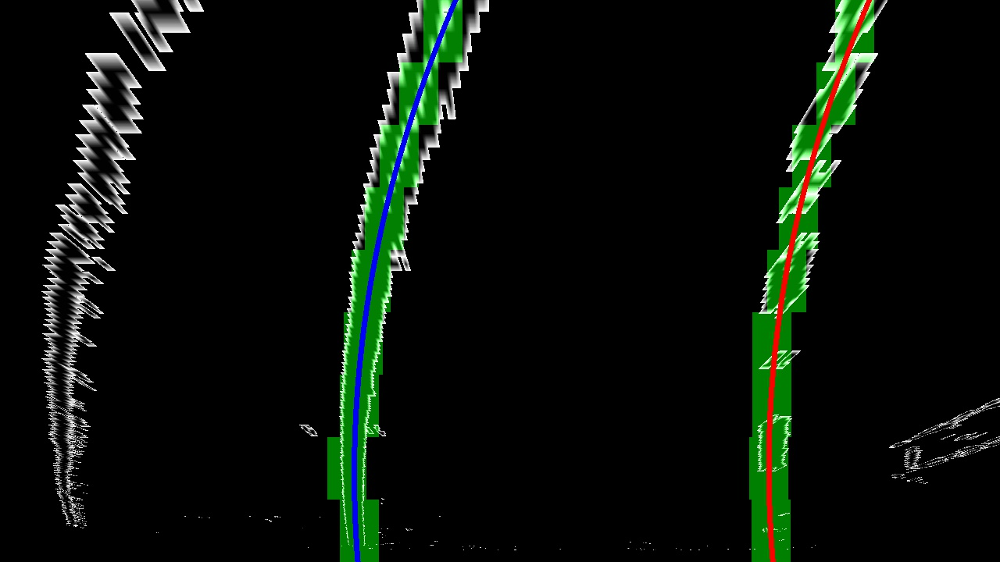
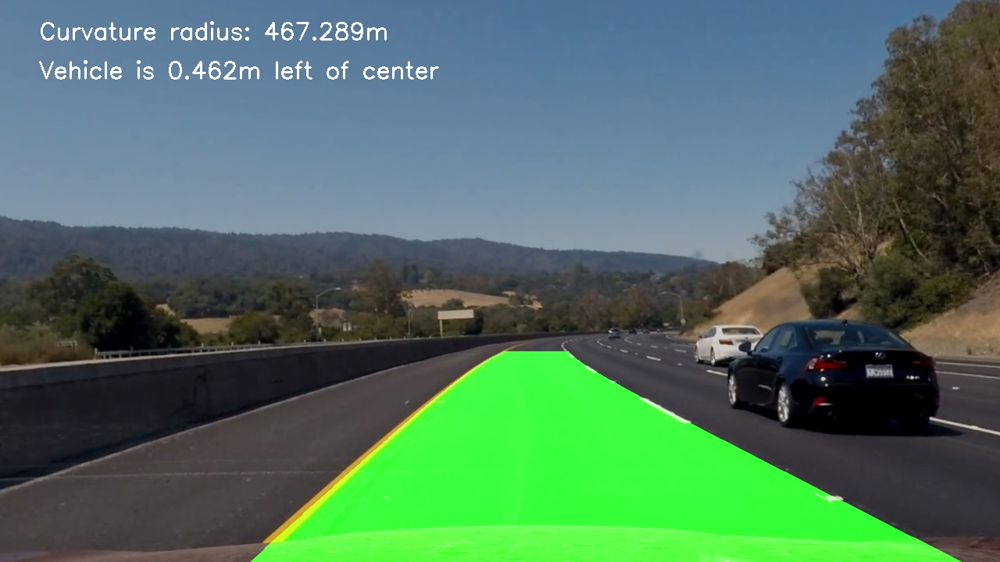

# Advanced Lane Finding Project

This project uses computer vision techniques to identify lane boundaries of videos from a camera mounted
on a car while driving in various situations. The method developed here should generally be appropriate
for videos recorded from the perspective of the driver.

This report will focus on addressing each of the project's [rubric points](https://review.udacity.com/#!/rubrics/571/view).

## Summary

This pipeline processes videos taken from the driver's perspective, where each frame is transformed to a
topographical map or bird's-eye view perspective. From this elevated perspective, the lane boundaries
should be parallel and the immediate path may be modeled/fit with a polynomial equation.
The resulting lane boundary lines are plotted and transformed back to the driver's perspective
to trace an outline, identifying the driver's lane for some distance ahead.

* Compute the camera calibration matrix and distortion coefficients given a set of chessboard images.
* Apply a distortion correction to each frame of a given driving video.
* Apply a series of color and gradient transforms to each frame to create a thresholded binary image emphasizing lane
boundaries for precise lane detection.
* Apply a perspective transform to rectify the binary image into a bird's-eye view or map perspective.
* Detect lane boundary pixels (right and left) and fit to a polynomial equation for numerical analysis
  and projection.
* Determine the curvature of the lane, and the vehicle position with respect to the center of the lane.
* Plot the curve equations and apply the inverse perspective transform back to the driver's perspective.
* Output a video that includes a visual display of the lane boundaries and a numerical estimation of the
  lane curvature and vehicle position.

## Camera Calibration

The code for this step is contained in [cam_calibrate.py](cam_calibrate.py).  

Prepare "object points", which will be the (x, y, z) coordinates of the chessboard corners in the world. Assume the
chessboard is fixed on the (x, y) plane at z=0, such that the object points are the same for each calibration image.
Thus, `objp` is just a replicated array of coordinates, and `objpoints` will be appended with a copy of it every time
all chessboard corners in a test image are detected. `imgpoints` will be appended with the (x, y) pixel
position of each of the corners in the image plane with each successful chessboard detection.  

Use the output `objpoints` and `imgpoints` to compute the camera calibration and distortion coefficients using the `cv2.calibrateCamera()`
function. The coefficients were saved (pickled) to `./camera_cal/calibration_params.p` to be used to correct distortion for all subsequent
image/video processing using the `cv2.undistort()` function.

#### Examples (see [correct_samples.py](correct_samples.py) for the source code):

Original calibration image:

Corrected:

## Pipeline (apply to each frame of a video)

The pipeline is a series of steps taken to process each frame of a video. Details of each of these steps follows
with examples at various stages of the pipeline.

Raw frame image (note that this is not actually from one of the test images):

See [output_images](output_images) for more examples.

1. Distortion correction using the saved camera calibration coefficients

   Refer to the source code from `zone.py` line 499 - image corrected for distortion:

   

2. Color and gradient transforms to emphasize lane boundary lines

   Transform steps (`zone.py lines 393-434`):
   2. Apply the Sobel algorithm to a grayscaled transform to highlight the gradient in both x and y dimensions individually.
   3. Threshold the Sobel transforms.
   4. Isolate the V channel (value) when converting to the HSV color model.
   5. Isolate the S channel (saturation) when converting to the HLS color model.
   6. Threshold the isolated S and V color channels.
   7. Combine the 4 thresholded transforms (binary image format) according to the configured combination method.

   Example result:
   
   

3. Bird's-eye view (map) perspective transform

   The code for transforming lane lines onto a map perspective includes the `extract_trapezoid_src()` function (`zone.py line 373`).
   This function generates coordinates of a trapezoid shape using lane boundary lines found by reusing code from the first project
   (CarND-LaneLines-P1). The top horizontal boundary of the trapezoid is calculated based on a configurable proportion of the
   horizon line determined by the top intersection of the rough (triangular) lane boundaries.
   The trapezoid coordinates are considered the source (`src`) of the perspective and the destination (`dst`) coordinates are based
   on an average of the right and left x coordinates of the trapezoid and y coordinates as-is. Once the `src` and `dst` coordinates
   are determined, the `cv2.getPerspectiveTransform()` function is used obtain the warp parameters M, (and Minv, to restore the
   driver's perspective) (`zone.py lines 523-529`). With the warp params, the function `cv2.warpPerspective()` is then used
   to obtain the map perspective.
   
   I verified that my perspective transform was working as expected by drawing the `src` points onto a test image and
   its warped counterpart to verify that the lines appear parallel in the warped image.
   
   Trapezoid drawing:
   
   
   
   Transformed to a map perspective with parallel lane boundary lines:
   
   
   
4. Lane boundary detection and curve fitting

   With the lane lines emphasized and transformed onto a map perspective, I used a convolution technique as described in
   the class lessons to identify precise points along the lane boundaries. This technique involved dividing the image
   into several evenly spaced horizontal sections or layers as referenced in the code, (`find_window_centroids()` function,
   `zone.py` line 711). Each layer is reduced to a 1-D array of the number of "on" pixels (binary image) for a given x position, similar
   to a histogram of pixel density along the x-axis. A convolutional window is passed along this histogram starting
   at the x position of the lane boundary from the previous layer, with a margin on either side to find the peak density for the current layer.
   A convolution is performed twice for each layer, once for each of the right and left lane boundaries.
   
   Once the points (centroids) are found for all layers, they are fit to a second-order polynomial equation (`zone.py` line 551).
   Next, the points and polynomial coefficients are passed through some sanity checks to make sure
   they resemble real lane boundaries on a road (`validate_fit_lanes()` function from `zone.py` line 799).
   Finally, the polynomial coefficients are added to a history buffer and averaged/smoothed over a configured number
   of frames for gradual lane evolution as the vehicle moves (`normalize_fit_lanes()` function from `zone.py` line 835).
   
   Example visualization of locating the lane line positions for each layer (convolutional windows in green). The curve-fitted
   lane boundaries are drawn as well (blue on the left side, red on the right).
   
   

5. Determine road curvature and position of the vehicle within its lane

   To estimate the radius of the road curvature, I fit the left lane boundary to the same second order polynomial, but using
   x,y coordinates converted to units of meters (rather than just pixels) using an estimated factor of m/px.
   The resulting coefficients were used in a known equation to calculate the radius from lesson 16, section 36
   (`zone.py` lines 824-829).
   
   To determine the position of the vehicle offset from the center of its lane, I assumed the center of the image is
   the center of the vehicle and simply calculated the difference of the left and right boundaries with respect
   to the center of the image. With that offset, I used the same m/px factor to estimate the distance in units of meters
   (`zone.py` lines 568-573).
   
   These two quantities are shown on the output video for each frame.

6. Driver's perspective

   The final step involves filling the area between the lane boundaries using the green color channel. This drawing
   (still in the map perspective) is then transformed back into the driver's perspective and combined with the original
   frame image to visualize the accuracy of this lane identification process. Refer to the source code `zone.py` and the
   `driver_perspective()` function line 72.
   
   

## Pipeline (video)

The `find_lane_boundaries.py` script may be executed to run this pipeline on the three videos provided in this project
including the two challenge videos. This script uses different configurations that are tuned specifically for each
video.

Results:

* [output_videos/project_video_lane.mp4](output_videos/project_video_lane.mp4)
* [output_videos/challenge_video_lane.mp4](output_videos/challenge_video_lane.mp4)
* [output_videos/harder_challenge_video_lane.mp4](output_videos/harder_challenge_video_lane.mp4)

## Discussion

My approach to this project was to build on the work from the related, initial lane-finding project but using the advanced
techniques presented in the lessons. The important areas I focused on were:

* Lane boundary isolation - leveraging concepts in the lessons and utilizing the OpenCV library to emphasize lines in
the road and de-emphasize everything else. A combination of thresholded Sobel transforms and extracted S and V
color channels (from HSL and HSV color transforms respectively) proved effective and versatile in many different lighting conditions,
shadows and varying colors of the road background. Each of the provided videos needed to be tuned with respect to these
transforms mostly in terms of threshold minimum values. With different combinations of these transforms (and/or binary
combinations) I was able to stabilize the lane boundaries on `challenge_video_lane.mp4`. In this video, defects in the road
might otherwise appear as lane boundaries, which I alluded to from the discussion of the first project (101 Southbound near
Palo Alto).

* Once a rough outline of the lane boundaries was found, I focused on improving the accuracy of identifying precise coordinates
of the boundary lines as they curved and evolved from frame to frame. I could have spent much more time on this area but at some
point I had to find a stopping point due to time constraints. I started with the suggested approach of slicing a given frame
into horizontal sections and finding the lane boundary positions based on pixel density close to the positions from the previous
slice (from the bottom up). The major improvements I explored were using properties of the lane from previous frames, assuming
lane boundaries evolve gradually from frame to frame. There is much more room for improvement here as can be seen from the results
of [harder_challenge_video.mp4](output_videos/harder_challenge_video_lane.mp4), in which there are periods where the identified
lane position shifts abruptly from frame to frame.

Another approach I'd like to explore to address the problem areas mentioned above are object tracking methods (OpenCV MOG, etc),
which use frame-to-frame motion detection. This is similar to Sobel gradient outlines but using a gradient from the pixel differences
between frames. This method is sensitive to lane position evolution and could be quite effective at identifying the lane coordinates
under extreme lighting conditions, shadows, weather (rain scattering light, etc) and background noise.
